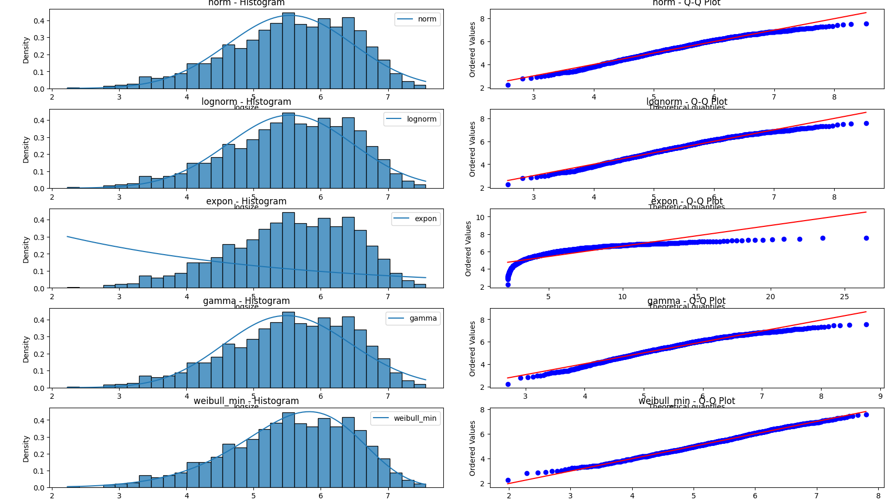
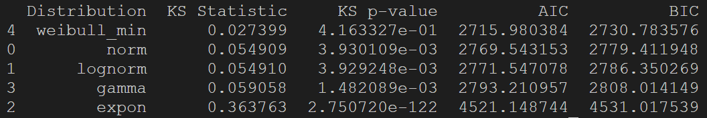
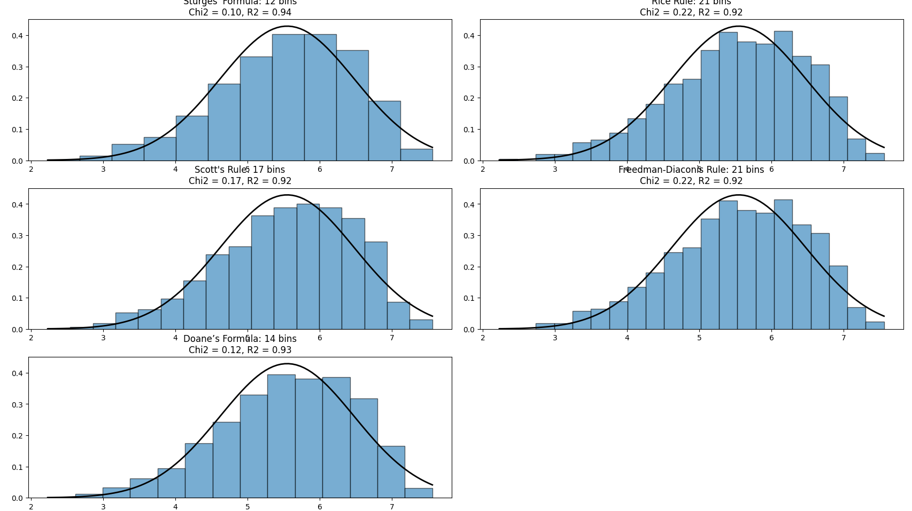

# Histogram Bin Size Optimizer

These scripts are used to analyze histogram data to determine optimal (1) model of fit and (2) bin size for normal distributions.

## example output
For an example CSV from the Vincent Arel-Bundock's [histogram data](https://vincentarelbundock.github.io/Rdatasets/datasets.html) (log size of trees), the following output was generated:

### Distribution optimizer with fits and QQ plots

### Distribution stats (terminal output)

### Bin size optimizer for normally distributed data

## To Use

Simply add your file path and the column label to the df_read_csv function for each script you plan to run

## Details
The compared bin size optimization methods are:

- Sturges' Formula
- Rice Rule
- Scott's Rule
- Freedman-Diaconis Rule
- Doane’s Formula

The compared distribution fits are:
- Normal
- Lognormal
- Exponential
- Gamma
- Weibull
